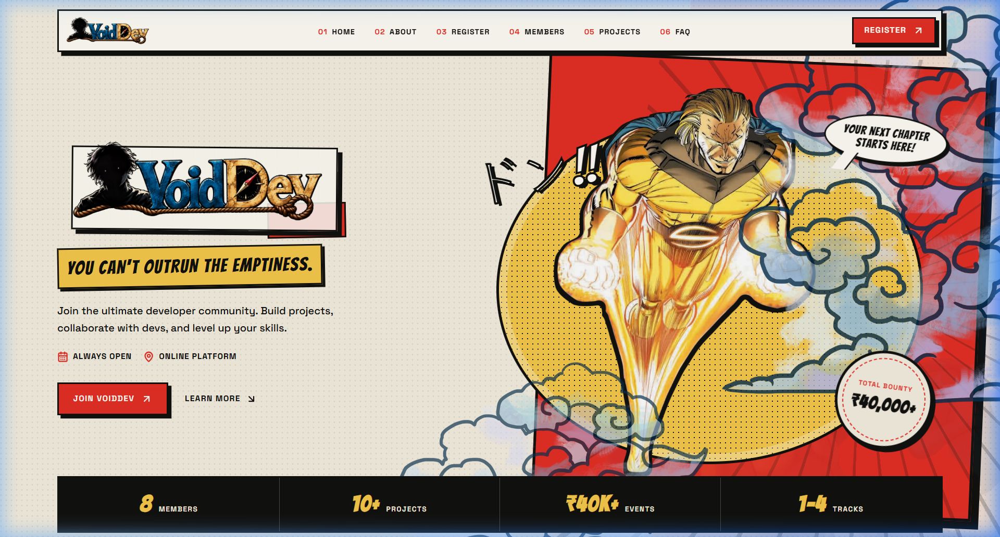
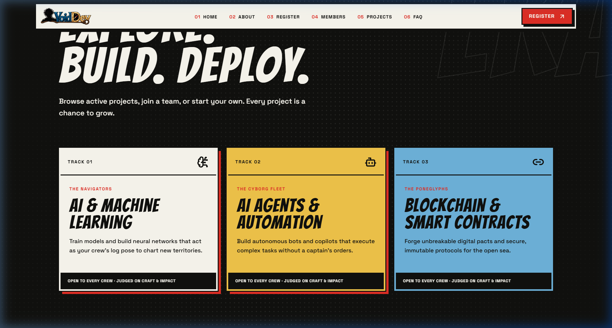
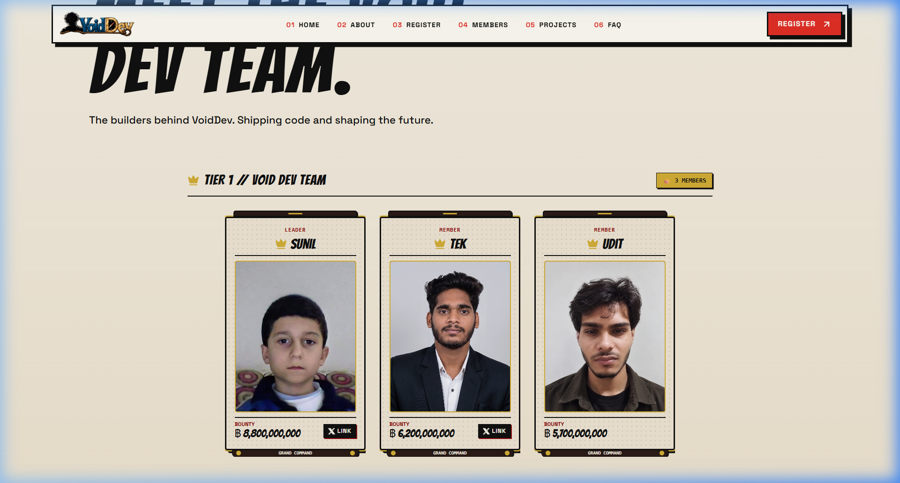
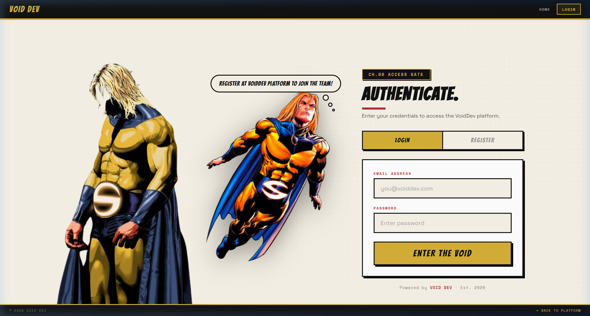

<p align="center">
  
</p>

<h1 align="center">VOID DEV — Enter the Void. Code the Future.</h1>

<p align="center">
  <strong>A manga-themed developer platform built for builders, hackers, and innovators.</strong><br/>
  <em>Bilaspur, Chouksey Group of Science and Commerce</em>
</p>

<p align="center">
  
  
  
  
</p>

---

## About

**VoidDev** is a premium, manga/comic-inspired developer platform featuring:

- **Manga Aesthetic** — Parchment textures, bold borders, Bangers typography, and dynamic animations
- **User Authentication** — Full registration & login system with bcrypt password hashing
- **Team Member Showcase** — Tiered member display with bounty cards and role badges
- **Bounty Poster Generator** — Create custom "Wanted" style developer posters
- **Fully Responsive** — Optimized for desktop, tablet, and mobile

---

## Screenshots

### Hero Section


### Tracks & Categories


### Team Members


### Login Page


---

## Tech Stack

| Layer | Technology |
|-------|-----------|
| **Frontend** | HTML5, CSS3, JavaScript (React SPA) |
| **Backend** | Node.js, Express.js |
| **Database** | Neon Postgres (Serverless) |
| **Auth** | bcrypt.js password hashing |
| **Fonts** | Bangers, Cinzel, Playfair Display, Space Grotesk |
| **Design** | Manga/Comic UI with GPU-accelerated animations |

---

## Getting Started

### Prerequisites

- **Node.js** v18+ installed
- **npm** package manager

### Installation

```bash
# Clone the repository
git clone https://github.com/Sunil56224972/Void-Dev-Platefrom.git
cd Void-Dev-Platefrom

# Install dependencies
npm install

# Start the API server (authentication)
node api-server.js

# In another terminal, start the frontend
npx http-server -p 3000 -c-1 --cors
```

### Access

- **Frontend:** [http://localhost:3000](http://localhost:3000)
- **API Server:** [http://localhost:3001](http://localhost:3001)
- **Login Page:** [http://localhost:3000/login.html](http://localhost:3000/login.html)

---

## Project Structure

```
Void-Dev-Platefrom/
├── index.html              # Main website (SPA)
├── login.html              # Authentication page (Register/Login)
├── api-server.js           # Express.js API server
├── package.json            # Dependencies
├── assets/
│   ├── routes-DpZvzpey.js  # App routes & member data
│   ├── index-Ct58Mbs6.js   # Core React bundle
│   ├── Footer-CXhAptDW.js  # Footer component
│   ├── styles-DCIjP5mH.css # Main stylesheet
│   ├── voiddev-main.png    # Brand logo
│   ├── voiddev-nav.jpg     # Navigation logo
│   ├── void.png            # Hero character
│   ├── body-sentry.png     # Login page character
│   ├── smashing.png        # Animated character
│   └── udit/               # Member assets
├── screenshots/            # Platform screenshots
└── .gitignore
```

---

## Features

### Authentication System
- User registration with email validation
- Secure login with bcrypt password hashing
- Duplicate email detection
- Manga-styled fly-in character animation on login page

### Member Showcase
- Tiered member display (Tier 1 Leaders)
- Individual bounty amounts per member
- Role badges and department tags
- Profile images with manga card design

### Bounty Poster Generator
- Custom hacker name & team name
- Randomized bounty amounts
- Photo upload with zoom/pan controls
- Red stamp overlay options
- High-res 300 DPI export
- LinkedIn sharing integration

---

## Team

| Member | Role | Bounty |
|--------|------|--------|
| **Sunil** | Leader | 8,800,000,000 |
| **Tek** | Member | 6,200,000,000 |
| **Udit** | Member | 5,700,000,000 |

---

## Contact

- **Email:** sunilnathyogi008@gmail.com
- **Instagram:** [@kali_linux_user_](https://www.instagram.com/kali_linux_user_/)
- **X (Twitter):** [@Sunilyogi008](https://x.com/Sunilyogi008)

---

<p align="center">
  <strong>ENTER THE VOID. CODE THE FUTURE.</strong><br/>
  <em>Built by VoidDev Team</em>
</p>
